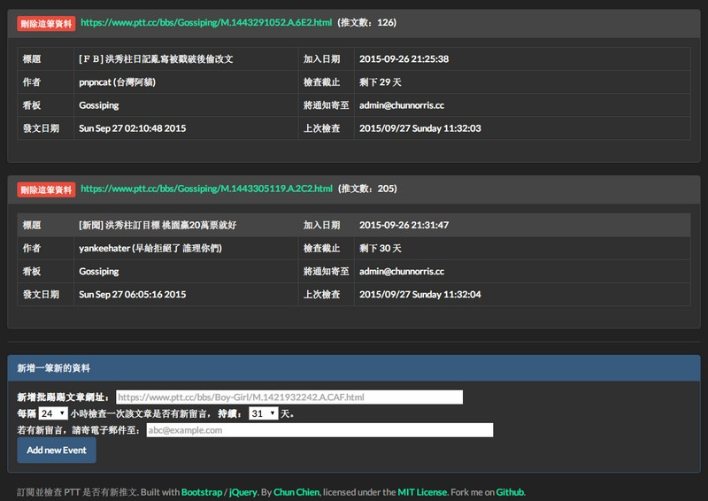
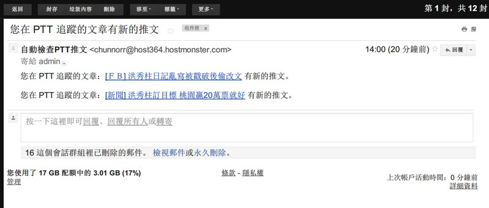
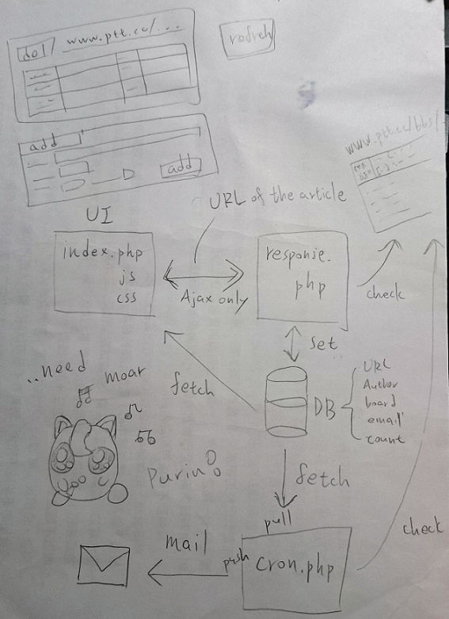
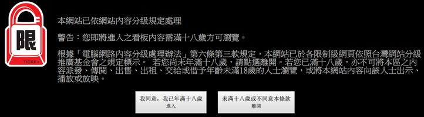

# send-email-when-ptt-posts-update

自動檢查 PTT 某文章是有更新，並寄信通知。

## 架構

使用者可透過網頁介面(`index.php`,`index.js`,`index.css`) 註冊感興趣的 PTT 文章(e.g. `https://www.ptt.cc/bbs/Gossiping/M.1443172611.A.FA7.html`)，填入自己的 e-mail，按下確定後，透過 AJAX 將資料丟給後方(`response.php`)檢查、抓取文章 meta 等資料後存入資料庫。

在 Unix 機器設定 cron 去跑 `cron.php`，如果發現訂閱的文章有新的推文，就自動寄信通知使用者。

大概是下面這個樣子：

原本想拿來練習 Angular.js，但最後還是用 jQuery。有蠻多地方可以改進，code 很醜，不必要的 Ajax ，但目前已能符合我自己的使用狀態，暫時不修改。

## 警告：您即將進入之看板內容需滿十八歲方可瀏覽

當欲進入 八卦版 或 西斯板 等 PTT 看板時，會先被轉到上方畫面。

此時用 `php curl` 會抓不到東西，

用 `curl_setopt($curl, CURLOPT_FOLLOWLOCATION, true);`

配上 `curl_setopt($ch, CURLOPT_COOKIE, 'over18=1');`

就可以繞過這個確認機制，直接抓取頁面。

## License

This project is licensed under the terms of the [MIT license](http://opensource.org/licenses/MIT).

Please note that this project is built with materials from the following parties:

- [Bootstrap](http://getbootstrap.com/)
- [Darkly](http://bootswatch.com/darkly/)
- [jQuery](https://jquery.com/)

Please also refer to their Licenses for further information.
